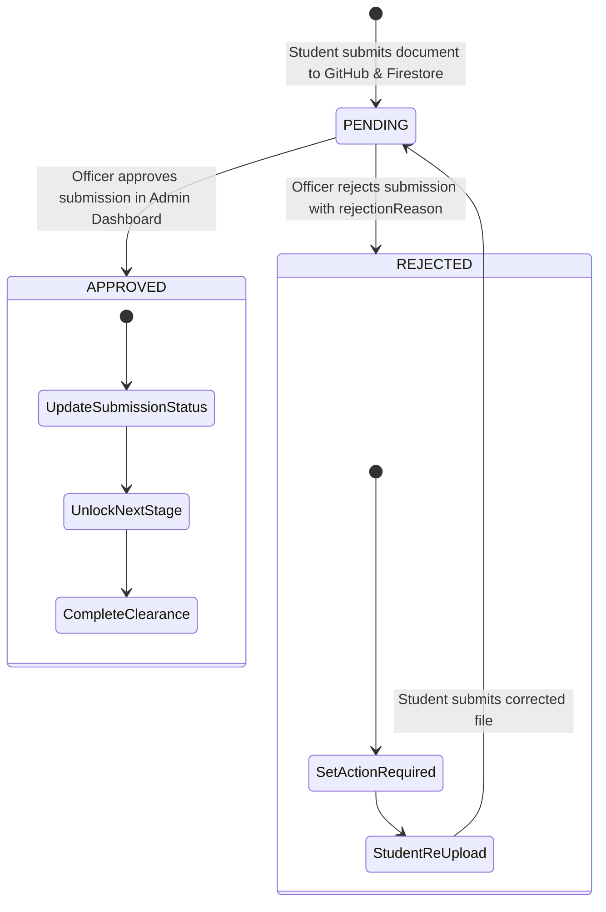

# JSP Digital Clearance System: Cross-App Architecture & DB Integration Guide

This specification serves as the technical integration manual for Admin and Student Portal developers. It defines the shared Firestore data contracts, stage mappings, document schemas, and GitHub storage pipeline.

---

## 1. System Architecture Overview

```
 ┌─────────────────────────────────────────────────────────────┐
 │                      STUDENT PORTAL                         │
 │                   (React / Vite WebApp)                     │
 └──────────────┬───────────────────────────────▲──────────────┘
                │ 1. Upload File & Metadata     │ 4. Real-time Status Sync
                ▼                               │    (Approved / Rejected)
 ┌─────────────────────────────┐ ┌──────────────┴──────────────┐
 │    GITHUB REPOSITORY        │ │     FIREBASE FIRESTORE      │
 │  (Contents API Cloud CDN)   │ │      (Real-time Cloud DB)   │
 │                             │ │                             │
 │  • uploads/clearance/       │ │  • submissions              │
 │    {uid}/{stage}/{file}     │ │  • students                 │
 │  • Public raw CDN URLs      │ │  • jsp_documents            │
 └──────────────┬──────────────┘ │  • jsp_clearance_records    │
                │ Raw URL Link   │  • notifications            │
                ▼                └──────────────▲──────────────┘
 ┌──────────────────────────────────────────────┴──────────────┐
 │                       ADMIN PORTAL                          │
 │                   (React / Vite Dashboard)                  │
 └─────────────────────────────────────────────────────────────┘
```

---

## 2. Stage Mapping Matrix

The student portal displays numerical stages (1 to 8), while the Admin Dashboard references string keys (`ClearanceStageKey`).

| Numerical ID | Student Stage Title | Admin `stageId` Key | Primary Required Document | Default Receipt Prefix |
|---|---|---|---|---|
| **1** | Admission Verification | `admission` | JAMB & School Admission Letter | `ADM-` |
| **2** | Faculty / Departmental Sign-off | `faculty` | Departmental Dues Receipt & Course Form | `FAC-` |
| **3** | Bursary & Finance Clearance | `bursary` | School Fees Remita RRR & Clearance Receipt | `BUR-` |
| **4** | Polytechnic Library Clearance | `library` | Library Registration Card & Book Return Note | `LIB-` |
| **5** | Sports & Recreation Unit | `sports` | Sports Equipment Return & Dues Receipt | `SPT-` |
| **6** | Directorate of Student Affairs | `student_affairs` | Code of Conduct Affidavit & ID Clearance | `DSA-` |
| **7** | Hall of Residence / Accommodation | `accommodation` | Hostel Clearance Slip & Key Return Note | `ACC-` |
| **8** | Academic Board / Final Graduation | `graduation` | Final Project Clearance & Alumni Receipt | `ACD-` |

---

## 3. Firestore Collections & Field Specifications

### A. Collection: `submissions` (Primary Admin Review Queue)
Written by Student App on document upload; updated by Admin on review.

| Field Name | Type | Description | Example |
|---|---|---|---|
| `id` | `string` | Unique Submission / Document ID | `"doc_1725223000123_456"` |
| `studentId` | `string` | Firebase Auth UID of the student | `"8F7xX0ZqJ9P..."` |
| `studentName` | `string` | Full name of the student | `"Amina Bello Sani"` |
| `matricNumber` | `string` | Official matriculation number | `"JSP/2022/COM/0142"` |
| `departmentName` | `string` | Student's academic department | `"Computer Science"` |
| `stageId` | `string` | Stage key (`admission`, `bursary`, etc.) | `"bursary"` |
| `stageName` | `string` | Display name of clearance stage | `"Bursary & Finance Clearance"` |
| `requirementId` | `string` | ID of requirement | `"req_bursary_3"` |
| `requirementName` | `string` | Type of document uploaded | `"School Fees Remita RRR Receipt"` |
| `fileUrl` | `string` | Public raw GitHub file URL or Data URI | `"https://raw.githubusercontent.com/.../file.pdf"` |
| `fileName` | `string` | Original file name | `"JSP_2022_COM_0142_Bursary.pdf"` |
| `fileType` | `string` | Extension (`pdf`, `jpg`, `png`, `jpeg`) | `"pdf"` |
| `fileSize` | `number` | Size of file in bytes | `245760` |
| `status` | `string` | Current review status (`pending`, `approved`, `rejected`) | `"pending"` |
| `submittedAt` | `string` | ISO timestamp of submission | `"2026-09-01T22:00:00.000Z"` |
| `reviewedAt` | `string` | *(Optional)* ISO timestamp when reviewed | `"2026-09-01T22:15:00.000Z"` |
| `reviewedBy` | `string` | *(Optional)* Name or ID of clearance officer | `"Dr. Aliyu Ibrahim"` |
| `reviewComment` | `string` | *(Optional)* Officer's remark | `"All fees verified on Remita ledger"` |
| `rejectionReason`| `string` | *(Optional)* Explanation if rejected | `"RRR receipt is blurred. Please re-upload"` |

---

### B. Collection: `students` (Student Master Directory)
Synced whenever a student registers, logs in, or submits documents.

| Field Name | Type | Description | Example |
|---|---|---|---|
| `id` | `string` | Firebase Auth UID | `"8F7xX0ZqJ9P..."` |
| `studentId` | `string` | Matric Number or fallback ID | `"JSP/2022/COM/0142"` |
| `fullName` | `string` | Full Student Name | `"Amina Bello Sani"` |
| `matricNumber` | `string` | Official Matric Number | `"JSP/2022/COM/0142"` |
| `email` | `string` | Registered Email Address | `"amina.bello@jigpoly.edu.ng"` |
| `departmentId` | `string` | Department code | `"dept_1"` |
| `departmentName` | `string` | Department title | `"Computer Science"` |
| `level` | `string` | Class level (`ND I`, `ND II`, `HND I`, `HND II`) | `"ND II"` |
| `session` | `string` | Academic session | `"2024/2025 Academic Session"` |
| `clearanceStatus`| `string` | Aggregate status (`not_started`, `in_progress`, `approved`, `rejected`) | `"in_progress"` |
| `active` | `boolean` | Account active state | `true` |
| `createdAt` | `string` | ISO registration date | `"2026-09-01T21:00:00.000Z"` |

---

### C. Collection: `notifications` (Admin Alert Feed)
Triggered on new document submissions.

| Field Name | Type | Description | Example |
|---|---|---|---|
| `id` | `string` | Notification ID | `"notif_1725223000123"` |
| `studentId` | `string` | Firebase Auth UID | `"8F7xX0ZqJ9P..."` |
| `title` | `string` | Short title | `"New Clearance Upload: Bursary"` |
| `message` | `string` | Notification description | `"Amina Bello uploaded School Fees Receipt for review."` |
| `type` | `string` | Type (`submission`, `system`, `approval`, `rejection`) | `"submission"` |
| `read` | `boolean` | Whether an admin opened it | `false` |
| `createdAt` | `string` | ISO timestamp | `"2026-09-01T22:00:00.000Z"` |

---

### D. Collection: `jsp_documents` (Student Document Vault)
Maintains the student's individual document history.

| Field Name | Type | Description | Example |
|---|---|---|---|
| `id` | `string` | Document ID | `"doc_1725223000123_456"` |
| `studentUid` | `string` | Student Firebase UID | `"8F7xX0ZqJ9P..."` |
| `matricNumber` | `string` | Student matric number | `"JSP/2022/COM/0142"` |
| `stageId` | `number` | Numerical stage (1 - 8) | `3` |
| `stageTitle` | `string` | Title of clearance stage | `"Bursary & Finance Clearance"` |
| `documentType` | `string` | Category of document | `"School Fees Receipt"` |
| `fileName` | `string` | File name | `"JSP_2022_COM_0142_Bursary.pdf"` |
| `fileUri` | `string` | GitHub raw download URL | `"https://raw.githubusercontent.com/.../file.pdf"` |
| `hasAttachment`| `boolean` | Has attached file | `true` |
| `receiptNumber`| `string` | RRR / Receipt Ref | `"BUR-829104"` |
| `paymentDate` | `string` | Payment date string | `"2026-09-01"` |
| `status` | `string` | `PENDING_REVIEW` \| `APPROVED` \| `REJECTED` | `"PENDING_REVIEW"` |
| `remarks` | `string` | Student or system remarks | `"Uploaded via JSP Portal"` |
| `createdAt` | `number` | Unix epoch in ms | `1725223000123` |

---

### E. Collection: `jsp_clearance_records/{uid}` (Student Progress Record)
Stores full aggregated stage statuses for student portal rendering.

- **Document ID**: `{firebaseUser.uid}`
- **Fields**:
  - `uid`: `string`
  - `matricNumber`: `string`
  - `stages`: `Array<ClearanceStage>`
  - `documents`: `Array<ClearanceDocument>`
  - `activities`: `Array<ActivityItem>`
  - `alerts`: `Array<AlertItem>`
  - `lastUpdated`: `number` (Epoch ms)

---

## 4. GitHub File Storage Pipeline

- **API Endpoint**: `PUT https://api.github.com/repos/{owner}/{repo}/contents/{path}`
- **Storage Target**:
  ```
  uploads/clearance/{studentUid}/{stageKey}/{timestamp}_{filename}
  ```
- **Raw Public CDN URL**:
  ```
  https://raw.githubusercontent.com/{owner}/{repo}/{branch}/uploads/clearance/{studentUid}/{stageKey}/{timestamp}_{filename}
  ```
- **Supported File Types**: PDF (`application/pdf`), Images (`image/jpeg`, `image/png`, `image/webp`).
- **File Size Limit**: Up to 25 MB per file.

---

## 5. Review Lifecycle & Live Sync State Machine



### When Admin Approves:
1. `submissions/{id}` is updated with `status: 'approved'`, `reviewedAt`, `reviewedBy`.
2. Student app `onSnapshot` listener detects status change:
   - Sets current stage to `COMPLETED` and `documentStatus: 'APPROVED'`.
   - If next stage is `LOCKED`, unlocks it to `READY` (`actionButtonText: 'Start Clearance'`).

### When Admin Rejects:
1. `submissions/{id}` is updated with `status: 'rejected'`, `rejectionReason: '...'`.
2. Student app `onSnapshot` listener detects rejection:
   - Sets current stage to `ACTION_REQUIRED` and `documentStatus: 'REJECTED'`.
   - Displays officer's reason directly on stage card with button `Re-upload Now`.
